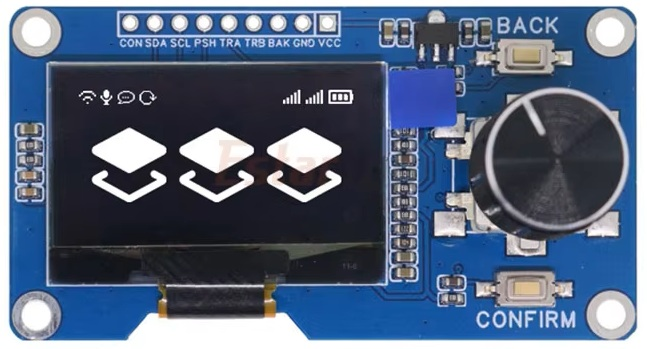
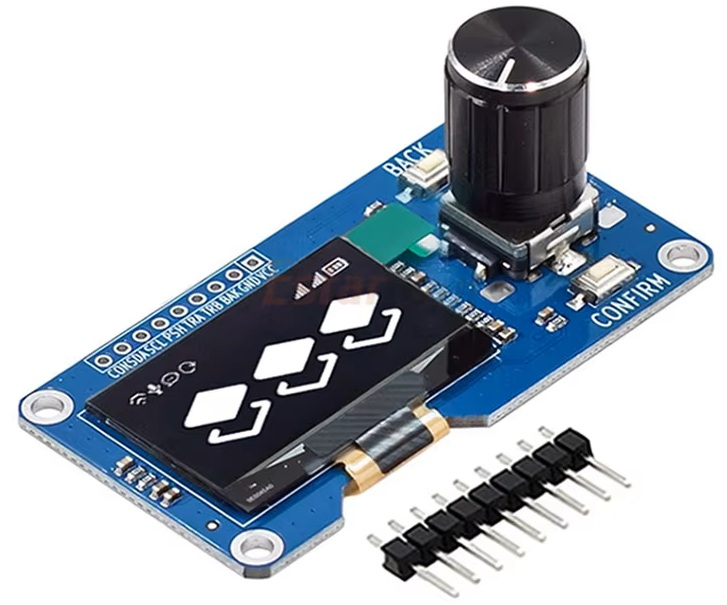
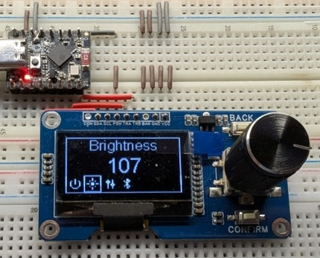
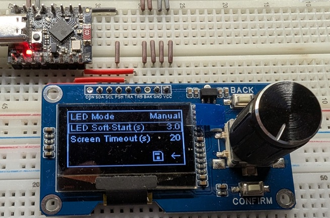

# ESP32 SH1116 OLED Module with EC11 Rotary Encoder Simple UI

This is a simple user interface library targeted for SH1106 OLED displays with EC11 rotary encoders, commonly sold in AliExpress listings.

It often can be bought USD$3-5 each (2026). Especially on bundle deals.

 

## Features
* Modular menu system. You deal with high level concepts like "Pages" and "Items" rather than line and pixel coordinates.
* Interrupt based rotary encoder and button handling. Keep your loop() free for other tasks.
* Internally context and state aware. You don't need to track where you are in the menu system. Provide a callback to get notified of your own event.
* Easy to extend with your custom pages and items.
* Uses only the encoder push button to navigate through the menu system.
* Advanced debouncing algorithm for [rotary encoders](https://github.com/futojin/esp32-sh1106-simpleUI/wiki/rotary-debouncing) and [switches](https://github.com/futojin/esp32-sh1106-simpleUI/wiki/switch-debouncing).
* Built-in screen timeout. Prolong those cheap OLED displays life.




## Usage


### Quick Demo
* The code below assume you're using PlatformIO. Remove `#include <Arduino.h>` if you're using Arduino IDE.
* Adjust input pin as necessary. (A, B, Push, I2C SDA/SCL)
* **DO NOT** power with 5V. Although the module can accept 5V input, the rotary encoder will be providing 5V signals to the ESP32.
* The module can be powered directly from the 3.3V pin of the ESP32. However ideally it should be powered from external 3.3V for reliability. In my ESP32-C3-supermini, the 3.3V pin dropped to around 2.7v.

```cpp
#include <Arduino.h>
#include "simpleUI.h"

//#define DEBUG_(fmt, ...) Serial.printf(fmt, ##__VA_ARGS__)
#ifndef DEBUG_
#define DEBUG_(...)
#endif

// Rotary Encoder
#define ROT_INPUT_PSH GPIO_NUM_0 // Rotary Push button
#define ROT_INPUT_A GPIO_NUM_20  // Rotary Encoder A
#define ROT_INPUT_B GPIO_NUM_21  // Rotary Encoder B

// I2C Pins
#define I2C_SDA_PIN GPIO_NUM_8
#define I2C_SCL_PIN GPIO_NUM_10

struct DisplayData
{
  uint8_t current_duty = 0; // Hypothetical LED driver brightness duty cycle (0-255)
  bool flipDisplay = false; // Whether this display is flipped vertically
} displayData;

// ##############################
// Menus intialization and event handling
// ##############################
SH1106Wire display(0x3C, I2C_SDA_PIN, I2C_SCL_PIN);
Container &container = Container::getInstance(display, ROT_INPUT_A, ROT_INPUT_B, ROT_INPUT_PSH);

void onHandleBrightnessChange(Item *item, const Event *event)
{
  static char brightnessValue[4]; // 4 characters long max
  DEBUG_("onHandleBrightnessChange: got event: %d, %d\n", event->eventId, event->value);
  DEBUG_("onHandleBrightnessChange: current duty: %d\n", displayData.current_duty);
  if (event->eventId == EVENT_ROT)
  {
    Event msg = *event;
    {
      if (msg.value == ROTARY_EVENT_CW)
      {
        // Clockwise: increase brightness
        if (displayData.current_duty < 255)
        {
          displayData.current_duty += 1;
        }
      }
      else if (msg.value == ROTARY_EVENT_CCW)
      {
        // Counter-clockwise: decrease brightness
        if (displayData.current_duty > 0)
        {
          displayData.current_duty -= 1;
        }
      }
    }
  }
  DEBUG_("onHandleBrightnessChange: brightness changed to: %d\n", displayData.current_duty);
  sprintf(brightnessValue, "%d", displayData.current_duty); // Convert to string to update display
  item->value = brightnessValue;
}

HeroPageItem brightnessHeroItem("Brightness", onHandleBrightnessChange);
PageItem brightnessItem("LED Brightness", onHandleBrightnessChange);
PageItem flipDisplayItem("Flip Display", [](Item *item, const Event *event)
  {
    static char flipValue[4];
    if (event->eventId == EVENT_ROT)
    {
      if (event->value == ROTARY_EVENT_CW || event->value == ROTARY_EVENT_CCW)
      {
        displayData.flipDisplay = !displayData.flipDisplay; // Toggle flip state
        container.flipDisplay(displayData.flipDisplay); // Apply
      }
    }
    DEBUG_("Flip Display toggled to: %s\n", displayData.flipDisplay ? "ON" : "OFF");
    sprintf(flipValue, "%s", displayData.flipDisplay ? "ON" : "OFF"); // Convert to string to update display
    item->value = flipValue;                                      // Update display value
  });

HeroPage mainPage(icon_bulb);
ListPage settingsPage(icon_settings);

void setup()
{
  // Container does not define pinMode directly.
  pinMode(ROT_INPUT_A, INPUT);
  pinMode(ROT_INPUT_B, INPUT);
  pinMode(ROT_INPUT_PSH, INPUT);

  Serial.begin(115200);
  container.initDisplay(); // Getting ready and to allow an early visual cue we are starting up...

  container.addPage(mainPage);
  container.addPage(settingsPage);

  mainPage.addItem(brightnessHeroItem);
  settingsPage.addItem(brightnessItem);
  settingsPage.addItem(flipDisplayItem);

  container.setCurrentPage(mainPage);
  container.start();
}

void loop()
{
}
```

## Extensions

## Credits
Built on top of the popular [SH1106Wire](https://github.com/ThingPulse/esp8266-oled-ssd1306/blob/master/README.md) library.

